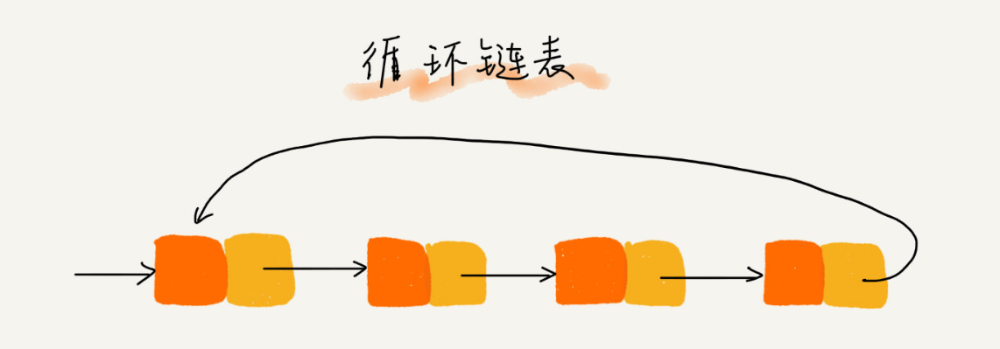

# data-structure
数据结构与算法

#### 01 为什么要学习数据结构与算法

- 数据结构和算法
- 操作系统
- 计算机网络


**时间复杂度**

**空间复杂度**

#### 02 如何高效学习数据结构与算法


**广义**

数据结构就是指一组数据的存储格式。

算法就是操作数据的一组方法。

**狭义**

指著名 的数据结构和算法，比如 队列、栈、堆、二分查找、动态规划等


**数据结构是为算法服务的，算法要作用在特定的数据机构中**


##### 学习重点

- 复杂度分析


**常用基础数据结构和算法**

- 数据结构
  - 数组
  - 链表
  - 栈
  - 队列
  - 散列表
  - 二叉树
  - 堆
  - 跳表
  - 图
  - Trie 数
- 算法
  - 递归
  - 排序
  - 二分查找
  - 搜索
  - 哈希算法
  - 贪心算法
  - 分治算法
  - 回溯算法
  - 动态规划
  - 字符串匹配


#### 03 复杂度分析（上）：如何分析、统计算法的执行效率和资源消耗

**快** **省**

- 时间复杂度
- 空间复杂度


##### 为什么要复杂度分析？

1. 测试结果非常依赖测试环境
2. 测试结果受数据规模的影响很大

##### 大 O 复杂度表示法

```java
public int cal(int n) {
    int sum = 0;
    int i = 1;
    for(;int i <= n; ++i) {
        sum = sum + i;
    }
    return sum;
}
```

**读数据-运算-写数据**

假设每行代码执行时间一样，为 **unit_time**

2、3 行代码分别要 1 个 **unit_time** 的执行时间

4、5 行代码运行了 n 遍

共 （2n+2）unit_time 的时间

代码的执行时间 **T(n)** 和每行代码的执行次数成正比


```java
 public int cal(int n) {
   int sum = 0;
   int i = 1;
   int j = 1;
   for (; i <= n; ++i) {
     j = 1;
     for (; j <= n; ++j) {
       sum = sum +  i * j;
     }
   }
 }

```

T(n) = (2n2+2n+3)*unit_time  


我来具体解释一下这个公式。其中，T(n) 我们已经讲过了，它表示代码执行的时间；n 表示数据规模的大小；f(n) 表示表示每行代码执行的次数总和。因为这是一个公式，所以用 f(n) 来表示。公式中的 O，表示代码的执行时间 T(n) 与  f(n) 表达式成正比。

**大O时间复杂度表示法**

并不具体表示代码真正的执行时间，而是表示代码执行时间随数据规模增长的变化趋势，也叫**渐进时间复杂度**

T(n) = O(n)； T(n) = O(n2)。


##### 时间复杂度分析

- 只关注循环执行次数最多的一段代码

```c++
 int cal(int n) {
   int sum = 0;
   int i = 1;
   for (; i <= n; ++i) {
     sum = sum + i;
   }
   return sum;
 }

```


- 加法法则：总复杂度等于量级最大的那段代码的复杂度

```c++
int cal(int n) {
   int sum_1 = 0;
   int p = 1;
   for (; p < 100; ++p) {
     sum_1 = sum_1 + p;
   }

   int sum_2 = 0;
   int q = 1;
   for (; q < n; ++q) {
     sum_2 = sum_2 + q;
   }
 
   int sum_3 = 0;
   int i = 1;
   int j = 1;
   for (; i <= n; ++i) {
     j = 1; 
     for (; j <= n; ++j) {
       sum_3 = sum_3 +  i * j;
     }
   }
 
   return sum_1 + sum_2 + sum_3;
 }

```

- 乘法法则：嵌套代码的复杂度等于嵌套内外代码复杂度的乘积

```c
int cal(int n) {
   int ret = 0; 
   int i = 1;
   for (; i < n; ++i) {
     ret = ret + f(i);
   } 
 } 
 
 int f(int n) {
  int sum = 0;
  int i = 1;
  for (; i < n; ++i) {
    sum = sum + i;
  } 
  return sum;
 }

```


##### 几种常见复杂度示例分析


- 多项式量级
- 非多项式量级 **O(2n) 和 O(n!)**

##### 空间复杂度分析

表示算法的存储空间和数据规模之间的增长关系

```java
void print(int n) {
  int i = 0;
  int[] a = new int[n];
  for (i; i <n; ++i) {
    a[i] = i * i;
  }

  for (i = n-1; i >= 0; --i) {
    print out a[i]
  }
}
```


####  04 复杂度分析（下）：浅析最好、最坏、平均、均摊时间复杂度

- 最好情况时间复杂度
- 最坏情况时间复杂度
- 平均情况时间复杂度
- 均摊时间复杂度

##### 最好、最坏情况时间复杂度

```java
// n 表示数组 array 的长度
int find(int[] array, int n, int x) {
  int i = 0;
  int pos = -1;
  for (; i < n; ++i) {
    if (array[i] == x) pos = i;
  }
  return pos;
}
```


### 05 数组：为什么很多编程语言中数组都从 0 开始编号？


##### 如何实现随机访问？

**数组是一种线性表数据结构。用一组连续的内存空间，来存储一组具有相同类型的数据。**

- 线性表

  - 数组
  - 链表
  - 队列
  - 栈

  

- 非线性表

  - 二叉树
  - 堆
  - 图

  

- 连续的内存空间和相同类型的数据


##### 低效的**"插入"**和**"删除"**

- 插入操作
- 删除操作


**警惕数组的访问越界问题**


##### 容器能否完全代替数组？

**ArrayList 优势**

-  将很多数组操作的细节封装起来
- 支持动态扩容
- 自动扩容 1.5 倍

```java
ArrayList<User> users = new ArrayList(10000);
for (int i = 0; i < 10000; ++i) {
  users.add(xxx);
}
```


用数组更适合的情况：

- Java ArrayList 无法存储基础数据类型，例如 int、long，需要封装成 Integer、Long 类，而 Autoboxing、unboxing 则有一定的性能消耗，所以如果特备关注性能，或者系统使用基本类型，就可以选用数组
- 如果数据大小事先已知，并且对数据的操作非常简单，用不到ArrayList 提供的大部分方法，也可以直接使用数组
- 多维数组


### 06 链表（上）：如何实现 LRU 缓存淘汰算法？

链表应用场景：LRU缓存淘汰算法


#### 缓存

- CPU 缓存
- 数据库缓存
- 浏览器缓存

#### 缓存淘汰策略

- 先进先出策略 FIFO
- 最少使用策略 LFU
- 最近最少使用策略 LRU

#### 五花八门的链表结构


- 单链表
- 双向链表
- 循环链表

##### 单链表


- 头结点
  - 记录链表的基地址
- 尾结点
  - 指针不是指向下一个结点，而是指向一个空地址 NULL，表示这是链表上最后一个结点

查找、插入、删除


随机查找：

时间复杂度 O(n)

##### 循环链表



##### 双向链表


##### 链表 VS 数组性能比较


### 07 链表（下）：如何轻松写出正确的链表代码


- **技巧一**：理解指针或引用的含义

  将某个变量赋值给指针，实际上就是将这个变量的地址赋值给指针，或者反过来说，指针中存储了这个变量的内存地址，指向了这个变量，通过指针就能找到这个变量。

- **技巧二**：警惕指针丢失和内存泄漏

- **技巧三**：利用哨兵简化实现难度

- **技巧四**：重点留意边界条件处理

  - 如果链表为空时，代码是否能正常工作？
  - 如果链表只包含一个结点时，代码是否能正常工作？
  - 如果链表只包含两个结点时，代码是否能正常工作？
  - 代码逻辑在处理头结点和尾结点时，是否能正常工作？

**5 个常见的链表操作**

- 单链表反转

  ```java
  /*
  public class ListNode {
      int val;
      ListNode next = null;
  
      ListNode(int val) {
          this.val = val;
      }
  }*/
  public class Solution {
      public ListNode ReverseList(ListNode head) {
         
          if(head==null)
              return null;
          //head为当前节点，如果当前节点为空的话，那就什么也不做，直接返回null；
          ListNode pre = null;
          ListNode next = null;
          //当前节点是head，pre为当前节点的前一节点，next为当前节点的下一节点
          //需要pre和next的目的是让当前节点从pre->head->next1->next2变成pre<-head next1->next2
          //即pre让节点可以反转所指方向，但反转之后如果不用next节点保存next1节点的话，此单链表就此断开了
          //所以需要用到pre和next两个节点
          //1->2->3->4->5
          //1<-2<-3 4->5
          while(head!=null){
              //做循环，如果当前节点不为空的话，始终执行此循环，此循环的目的就是让当前节点从指向next到指向pre
              //如此就可以做到反转链表的效果
              //先用next保存head的下一个节点的信息，保证单链表不会因为失去head节点的原next节点而就此断裂
              next = head.next;
              //保存完next，就可以让head从指向next变成指向pre了，代码如下
              head.next = pre;
              //head指向pre后，就继续依次反转下一个节点
              //让pre，head，next依次向后移动一个节点，继续下一次的指针反转
              pre = head;
              head = next;
          }
          //如果head为null的时候，pre就为最后一个节点了，但是链表已经反转完毕，pre就是反转后链表的第一个节点
          //直接输出pre就是我们想要得到的反转后的链表
          return pre;
      }
  }
  ```

- 链表中环的检测

- ```java
  
  ```

- 两个有序的链表合并

- 删除链表倒数第 n 个结点

- 求链表的中间结点


### 08 栈：如何实现浏览器的前进和后退功能？


栈是一种操作受限的线性表，只允许在一端插入和删除数据。

- 用数组实现的栈，叫顺序栈
- 用链表实现的栈，叫链式栈

```java
// 基于数组实现的顺序栈
public class ArrayStack {
  private String[] items;  // 数组
  private int count;       // 栈中元素个数
  private int n;           // 栈的大小

  // 初始化数组，申请一个大小为 n 的数组空间
  public ArrayStack(int n) {
    this.items = new String[n];
    this.n = n;
    this.count = 0;
  }

  // 入栈操作
  public boolean push(String item) {
    // 数组空间不够了，直接返回 false，入栈失败。
    if (count == n) return false;
    // 将 item 放到下标为 count 的位置，并且 count 加一
    items[count] = item;
    ++count;
    return true;
  }
  
  // 出栈操作
  public String pop() {
    // 栈为空，则直接返回 null
    if (count == 0) return null;
    // 返回下标为 count-1 的数组元素，并且栈中元素个数 count 减一
    String tmp = items[count-1];
    --count;
    return tmp;
  }
}

```


### 09 队列：队列在线程池等有限资源池中的应用


#### 如何理解“队列”？

队列是一种操作受限的线性表数据结构。


- 循环队列
- 阻塞队列
- 并发队列 

**Disruptor、Linux 环形缓存** 循环并发队列。

**Java concurrent** 并发包利用 **ArrayBlockingQueue** 实现公平锁。


#### 顺序队列和链式队列

先进先出

队尾插入，队头删除

用数组实现的队列叫做顺序队列，用链表实现的队列叫做链式队列

```java
// 用数组实现的队列
public class ArrayQueue {
  // 数组：items，数组大小：n
  private String[] items;
  private int n = 0;
  // head 表示队头下标，tail 表示队尾下标
  private int head = 0;
  private int tail = 0;

  // 申请一个大小为 capacity 的数组
  public ArrayQueue(int capacity) {
    items = new String[capacity];
    n = capacity;
  }

  // 入队
  public boolean enqueue(String item) {
    // 如果 tail == n 表示队列已经满了
    if (tail == n) return false;
    items[tail] = item;
    ++tail;
    return true;
  }

  // 出队
  public String dequeue() {
    // 如果 head == tail 表示队列为空
    if (head == tail) return null;
    // 为了让其他语言的同学看的更加明确，把 -- 操作放到单独一行来写了
    String ret = items[head];
    ++head;
    return ret;
  }
}

```

**数据搬移**

**基于链表的队列实现方法**


**循环队列**

```java
public class CircularQueue {
  // 数组：items，数组大小：n
  private String[] items;
  private int n = 0;
  // head 表示队头下标，tail 表示队尾下标
  private int head = 0;
  private int tail = 0;

  // 申请一个大小为 capacity 的数组
  public CircularQueue(int capacity) {
    items = new String[capacity];
    n = capacity;
  }

  // 入队
  public boolean enqueue(String item) {
    // 队列满了
    if ((tail + 1) % n == head) return false;
    items[tail] = item;
    tail = (tail + 1) % n;
    return true;
  }

  // 出队
  public String dequeue() {
    // 如果 head == tail 表示队列为空
    if (head == tail) return null;
    String ret = items[head];
    head = (head + 1) % n;
    return ret;
  }
}
```


**阻塞队列和并发队列**

- 阻塞队列 生产者和消费者模型
- 并发队列 线程安全的队列  CAS 原子操作


线程池没有空闲线程时，新的任务请求线程资源时，线程池该如何处理？各种处理策略又是如何实现的呢？

**两种处理策略**

- 非阻塞的处理方式，直接拒绝任务请求
- 阻塞方式，将请求排队，等到有空闲线程时，取出排队的请求继续处理。

如何存储排队的请求呢？

队列来存储排队请求。

- 基于链表的实现方式，可以实现一个支持无线排队的无界队列，但是可能导致过多的请求排队等待，请求处理的响应时间过长。所以，针对响应时间比较敏感的系统，基于链表实现的无限排队的线程池是不合适的。
- 基于数组实现的有界队列，队列的大小有限，所以线程池中排队的请求超过队列大小时，接下来的请求就会被拒绝，这种方式对响应时间敏感的系统来说，就相对更加合理。


### 10 递归：如何用三行大吗找到“最终推荐人”？

- 动态规划
- 递归
  - DFS 深度优先搜索
  - 前中后序二叉树遍历


#### 递归需要满足的三个条件

1. 一个问题的解可以分解为几个子问题的解
2. 这个问题与分解之后的子问题，除了数据规模不同，求解思路完全一样
3. 存在递归终止条件


- 堆栈溢出  设置深度 depth
- 重复计算 散列表保存已经计算好的值

```java
long findRootReferrerId(long actorId) {
  Long referrerId = select referrer_id from [table] where actor_id = actorId;
  if (referrerId == null) return actorId;
  return findRootReferrerId(referrerId);
}
```


### 11 排序（上）：为什么插入排序比冒泡排序更受欢迎？

- 猴子排序
- 睡眠排序
- 面条排序
- 冒泡排序
- 插入排序
- 选择排序
- 归并排序
- 快速排序
- 计数排序
- 基数排序
- 桶排序


#### 如何分析一个“排序算法”

**排序算法的执行效率**

- 最好情况、最坏情况、平均情况时间复杂度
- 时间复杂度的系数、常数、低阶
- 比较次数和交换（或者移动）次数

**排序算法的内存消耗**

算法的内存消耗可以通过空间复杂度来衡量。

**原地排序**，特指空间复杂度是O(1)的排序算法。

**排序算法的稳定性**


#### 冒泡排序

```java
// 冒泡排序，a 表示数组，n 表示数组大小
public void bubbleSort(int[] a, int n) {
  if (n <= 1) return;
 
 for (int i = 0; i < n; ++i) {
    // 提前退出冒泡循环的标志位
    boolean flag = false;
    for (int j = 0; j < n - i - 1; ++j) {
      if (a[j] > a[j+1]) { // 交换
        int tmp = a[j];
        a[j] = a[j+1];
        a[j+1] = tmp;
        flag = true;  // 表示有数据交换      
      }
    }
    if (!flag) break;  // 没有数据交换，提前退出
  }
}
```


**1. 冒泡排序是原地排序算法吗？**

**2. 冒泡排序是稳定的排序算法吗？**

**3. 冒泡排序的时间复杂度是多少？**

**有序度**

#### 插入排序

```java
// 插入排序，a 表示数组，n 表示数组大小
public void insertionSort(int[] a, int n) {
  if (n <= 1) return;

  for (int i = 1; i < n; ++i) {
    int value = a[i];
    int j = i - 1;
    // 查找插入的位置
    for (; j >= 0; --j) {
      if (a[j] > value) {
        a[j+1] = a[j];  // 数据移动
      } else {
        break;
      }
    }
    a[j+1] = value; // 插入数据
  }
}
```


**1. 插入排序是原地排序算法吗？**

**2. 插入排序是稳定的排序算法吗？**

**3. 插入排序的时间复杂度是多少？**

#### 选择排序


冒泡排序和插入排序的时间复杂度都是 O(n2)，都是原地排序。


### 12 排序（下）：如何使用快排思想在O(n)内查找第 K 大元素？

**O(n2)**

- 冒泡排序
- 插入排序
- 选择排序

**nlogn**

- 归并排序
- 快速排序

分治思想

#### 归并排序

如果要排序一个数组，我们先把数组从中间分成前后两部分，然后对前后两部分分别排序，在将排好序的两部分合并在一起。

```java
递推公式：
merge_sort(p…r) = merge(merge_sort(p…q), merge_sort(q+1…r))

终止条件：
p >= r 不用再继续分解
```

```java
// 归并排序算法, A 是数组，n 表示数组大小
merge_sort(A, n) {
  merge_sort_c(A, 0, n-1)
}

// 递归调用函数
merge_sort_c(A, p, r) {
  // 递归终止条件
  if p >= r  then return

  // 取 p 到 r 之间的中间位置 q
  q = (p+r) / 2
  // 分治递归
  merge_sort_c(A, p, q)
  merge_sort_c(A, q+1, r)
  // 将 A[p...q] 和 A[q+1...r] 合并为 A[p...r]
  merge(A[p...r], A[p...q], A[q+1...r])
}

```

```java
merge(A[p...r], A[p...q], A[q+1...r]) {
  var i := p，j := q+1，k := 0 // 初始化变量 i, j, k
  var tmp := new array[0...r-p] // 申请一个大小跟 A[p...r] 一样的临时数组
  while i<=q AND j<=r do {
    if A[i] <= A[j] {
      tmp[k++] = A[i++] // i++ 等于 i:=i+1
    } else {
      tmp[k++] = A[j++]
    }
  }
  
  // 判断哪个子数组中有剩余的数据
  var start := i，end := q
  if j<=r then start := j, end:=r
  
  // 将剩余的数据拷贝到临时数组 tmp
  while start <= end do {
    tmp[k++] = A[start++]
  }
  
  // 将 tmp 中的数组拷贝回 A[p...r]
  for i:=0 to r-p do {
    A[p+i] = tmp[i]
  }
}
```


#### 快速排序的原理

如果要排序数组中下标 P 到 R 之间的一组数据，我们选择 P 到 R 之间的任意一个数据作为 PIVOT（分区点）

```java
递推公式：
quick_sort(p…r) = quick_sort(p…q-1) + quick_sort(q+1, r)

终止条件：
p >= r
```


```java
// 快速排序，A 是数组，n 表示数组的大小
quick_sort(A, n) {
  quick_sort_c(A, 0, n-1)
}
// 快速排序递归函数，p,r 为下标
quick_sort_c(A, p, r) {
  if p >= r then return
  
  q = partition(A, p, r) // 获取分区点
  quick_sort_c(A, p, q-1)
  quick_sort_c(A, q+1, r)
}
```


```java
partition(A, p, r) {
  pivot := A[r]
  i := p
  for j := p to r-1 do {
    if A[j] < pivot {
      swap A[i] with A[j]
      i := i+1
    }
  }
  swap A[i] with A[r]
  return i
```

